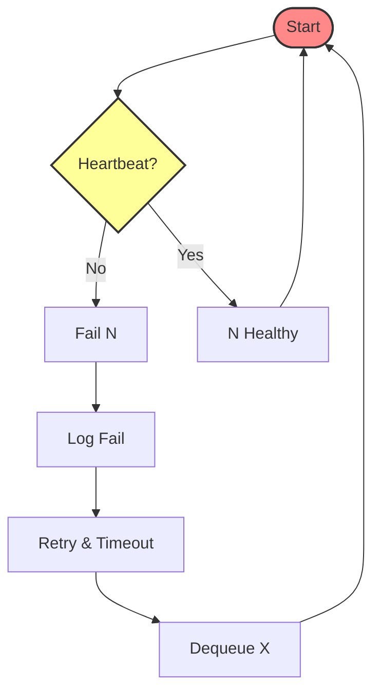

# System Architecture Document: Distributed Web Crawler & Search Indexer

## 1. Introduction

### 1.1 Purpose

This document describes the architecture of a distributed web crawling and indexing system designed for scalability, fault tolerance, and performance. It details the system's components, their interactions, data flow, technology stack, and initial strategies for handling failures.

### 1.2 Goals

* **Scalability:** Horizontally scale crawling and indexing capabilities to handle large portions of the web.
* **Fault Tolerance:** Ensure continuous operation despite individual component failures.
* **Performance:** Efficiently crawl websites, process content, build indices, and serve search queries.
* **Maintainability:** Design modular components with clear interfaces.

### 1.3 Scope

This document covers the architecture for crawling web pages starting from seed URLs, parsing content, extracting links, building a searchable index (inverted index), and providing a basic search query interface.

## 2. System Architecture Overview

The system employs a distributed, microservices-oriented architecture leveraging cloud infrastructure. It separates concerns into distinct layers: client interaction, orchestration, processing (crawling and indexing), messaging, and storage. Communication relies on asynchronous task queues and synchronous APIs where appropriate. Key design principles include decoupling via message queues, stateless worker nodes where possible, centralized orchestration, and reliance on managed cloud services for infrastructure components.

### 2.1 Component Diagram (Layered View)

  

*Diagram Description:* This diagram illustrates the high-level static structure organized into logical layers:
    -  **Clients (UI Layer):** User-facing interfaces (Web, CLI) for initiating and monitoering crawls, and submitting search queries.
    -  **Processing Layer:** Contains the core logic, including the central Master Node orchestrator and pools of scalable Crawler and Indexer nodes. Includes the external Websites being crawled.
    -  **Cloud Storage Layer:** Persistent storage for Seed URLs, raw crawled HTML (optional archival), and the built Search Index, utilizing cloud-based storage solutions.
    -  Arrows indicate primary control and data flow directions between components and layers.

### 2.2 Component Descriptions

* **Clients (UI Layer):**
  * Provides interfaces (Web UI, CLI Tool) for user interaction.
  * Allows users to submit seed URLs and crawl parameters.
  * Enables monitoring of crawling and indexing progress via the Master Node API.
  * Submits search queries to the Query Service and displays results.
* **Master Node (Controller/Scheduler):**
  * Central orchestration component managing the overall crawl lifecycle.
  * Receives crawl requests, validates seeds, and initializes jobs.
  * Manages pools of Crawler and Indexer nodes (registration, health monitoring via heartbeats).
  * Distributes crawl tasks (URLs) via the Crawl Task Queue.
  * Detects worker node failures and initiates recovery actions (logging, alerting, potentially triggering replacements).
  * Receives status reports from workers.
  * May coordinate high-level indexing operations (e.g., index merging triggers).
* **Crawler Nodes & Parser (Pool):**
  * Multiple worker instances responsible for fetching and initial processing.
  * Dequeue URL tasks from the Crawl Task Queue.
  * Respect `robots.txt` rules and implement politeness delays (rate limiting).
  * Fetch HTML content from external websites.
  * Parse HTML to extract text content and new hyperlinks.
  * Enqueue processed content/pages onto the Indexing Task Queue.
  * Optionally store raw HTML content to Raw HTML Storage.
  * Report status and discovered URLs back to the Master Node.
* **Indexer Nodes (Pool):**
  * Multiple worker instances responsible for building the search index.
  * Dequeue processed page data from the Indexing Task Queue ("Push to Index" queue).
  * Analyze text content (tokenization, stemming, etc.).
  * Build index structures (e.g., inverted index entries).
  * Write index segments/shards to the distributed Index Store.
  * Report indexing status back to the Master Node.
* **Task Queues (Implicit Messaging Layer):**
  * Utilizes distributed message queues (e.g., Celery with Redis, or cloud-native like SQS/PubSub).
  * **Crawl Task Queue:** Stores URLs waiting to be crawled; fed by Master, consumed by Crawlers.
  * **Indexing Task Queue ("Push to Index"):** Stores processed content waiting for indexing; fed by Crawlers/Parsers, consumed by Indexers.
  * Provides decoupling, buffering, and fault tolerance (task persistence, visibility timeouts).
* **Storage Layer Components:**
  * **Seed URL Store:** Persistent storage (e.g., AWS S3 bucket, database table) for initial seed URLs, accessed by the Master Node.
  * **Raw HTML Store:** (Optional) Object storage (e.g., AWS S3) for archiving raw fetched HTML content for debugging or reprocessing.
  * **Index Store:** Distributed, scalable, and persistent storage for the search index (e.g., Managed Elasticsearch cluster, distributed database like Cassandra/Bigtable configured for indexing, or segments on object storage). Must support efficient lookup for querying.
* **Query Service:**
  * Handles incoming search requests from Clients.
  * Parses search queries.
  * Interacts with the Index Store to retrieve relevant documents/posting lists.
  * Ranks results based on relevance scoring algorithms.
  * Generates snippets (optional).
  * Returns formatted search results to the Client.

### 2.3 Data Flow Diagram

*Diagram Description:* This diagram illustrates the primary dynamic flow of data through the system:
    1.  **Initiation:** User submits Seed URLs/Params via the Client to the Seed Loader/Master. Seeds are stored.
    2.  **Scheduling:** Master creates crawl tasks and enqueues URLs onto the Task Queue.
    3.  **Crawling:** Crawler dequeues a task, applies politeness rules, requests the URL from Websites, and receives Raw HTML.
    4.  **Parsing:** Crawler (or dedicated Parser component) parses Raw HTML, extracts links/text. Raw HTML may be stored in Raw Storage. Extracted links are reported back to the Master (Status) for potential scheduling.
    5.  **Indexing Queue:** Processed page data is enqueued onto the Ingest Queue.
    6.  **Indexing:** Indexer dequeues processed data, builds index entries, and writes them to the Index Store. Status reported to Master.
    7.  **Monitoring:** User monitors progress via Client, querying the Master Node.
    8.  **Querying:** User submits a query via Client to the Query Engine/Service.
    9.  **Lookup:** Query Engine looks up terms in the Index Store.
    10. **Ranking & Results:** Query Engine receives index data, ranks results, and returns Ranked Links/Results to the User via the Client.

## 3. API Interface Design

Well-defined API interfaces are critical even for internal communication. This section details the key endpoints and message formats for request-response interactions between components.

*(Note: Task queue interactions are asynchronous and not detailed here)*

### 3.1 Client - Master API

* **Start Crawl:** Endpoint: `POST /api/v1/crawls`
  
  * *Purpose:* Initiates a new crawl job.
  * *Payload Example:* See section 2.5 in previous response.
  * *Success Response Example (202 Accepted):* See section 2.5 in previous response.

* **Monitor Crawl Status:** Endpoint: `GET /api/v1/crawls/{crawlId}/status`
  
  * *Purpose:* Retrieves status for a specific crawl job.
  * *Path Parameter:* `{crawlId}`
  * *Success Response Example (200 OK):* See section 2.5 in previous response.

### 3.2 Worker - Master API

* **Register Worker:** Endpoint: `POST /api/v1/workers/register`
  
  * *Purpose:* Worker announces availability.
  * *Payload Example:* See section 2.6 in previous response.
  * *Success Response Example (200 OK / 204 No Content):* Acknowledgment.

* **Send Heartbeat:** Endpoint: `POST /api/v1/workers/{workerId}/heartbeat`
  
  * *Purpose:* Worker signals it's alive.
  * *Path Parameter:* `{workerId}`
  * *Success Response Example (204 No Content):* Acknowledgment.

* **Report Status / Update:** Endpoint: `POST /api/v1/workers/{workerId}/status`
  
  * *Purpose:* Worker reports status, metrics, or results.
  * *Path Parameter:* `{workerId}`
  * *Payload Example (Crawler/Indexer):* See section 2.6 in previous response.
  * *Success Response Example (204 No Content):* Acknowledgment.

### 3.3 Client - Query Service API

* **Submit Search Query:** Endpoint: `GET /api/v1/search`
  * *Purpose:* Executes a search query.
  * *Query Parameters:* `q` (required), `limit` (optional), `offset` (optional).
  * *Success Response Example (200 OK):* See section 2.7 in previous response.

## 4. Fault Tolerance & Reliability

Designing for failure is critical in a distributed system.

### 4.1 Risk Assessment Matrix

*Diagram Description:* This matrix identifies potential risks based on their likelihood (Rare, Moderate, Very Likely) and impact (Minor, Major, Extreme) *before* mitigation. Key risks include:
    *   **Parse Error (Rare, Minor):** Isolated parser failure on malformed HTML.
    *   **Indexer Loss (Rare, Major):** Indexer node failure losing in-memory state.
    *   **Master Failure (Rare, Extreme):** Complete failure of the central orchestrator.
    *   **Config Error (Moderate, Minor):** Incorrect non-critical parameter settings.
    *   **Crawler Failure (Moderate, Major):** Individual crawler node crash/unresponsiveness.
    *   **Bad Deploy (Moderate, Extreme):** Critical software bug deployment.
    *   **Site Error (Very Likely, Minor):** Target website temporary unavailability.
    *   **Throttling (Very Likely, Major):** Exceeding website crawl limits causing blocking.
    *   **Limit Reached (Very Likely, Extreme):** Exceeding capacity of a core resource.

### 4.2 Initial Fault Tolerance Plan: Crawler Node Failure

This section details the strategy for handling the failure of an individual Crawler Node, identified as a Moderate Probability / Major Impact risk *before* mitigation.

* **Detection Mechanisms:**
  * **Heartbeat Monitoring:** Active Crawlers send periodic heartbeats to the Master Node. Missed heartbeats within a defined threshold cause the Master to mark the node as `FAILED`.
  * **Task Queue Visibility Timeout:** When a Crawler dequeues a URL task, the message becomes invisible in the queue for a configured period. If the Crawler fails to process and delete the message within this timeout, the message automatically becomes visible again for another worker.
* **Recovery Actions:**
  * **Automatic Task Re-queueing:** The primary recovery mechanism leverages the queue's visibility timeout. Failed tasks reappear automatically without Master intervention.
  * **Master Node Response:**
    * Marks the failed node in its registry.
    * Stops assigning any direct work (if applicable).
    * Logs the failure event for monitoring and alerting.
    * (Optional) Triggers auto-scaling mechanisms to provision a replacement node.
* **Impact Reduction:** This strategy reduces the impact of a single Crawler failure from **Major** (stalled tasks, reduced throughput requiring manual intervention) to **Minor** (slight delay for specific tasks, temporary throughput dip until replacement). Task data (the URL to be crawled) is not lost due to queue persistence.

*(Further fault tolerance plans will address Indexer Node failure, Master Node high availability, Index Store replication/backup, and Queue service reliability).*
