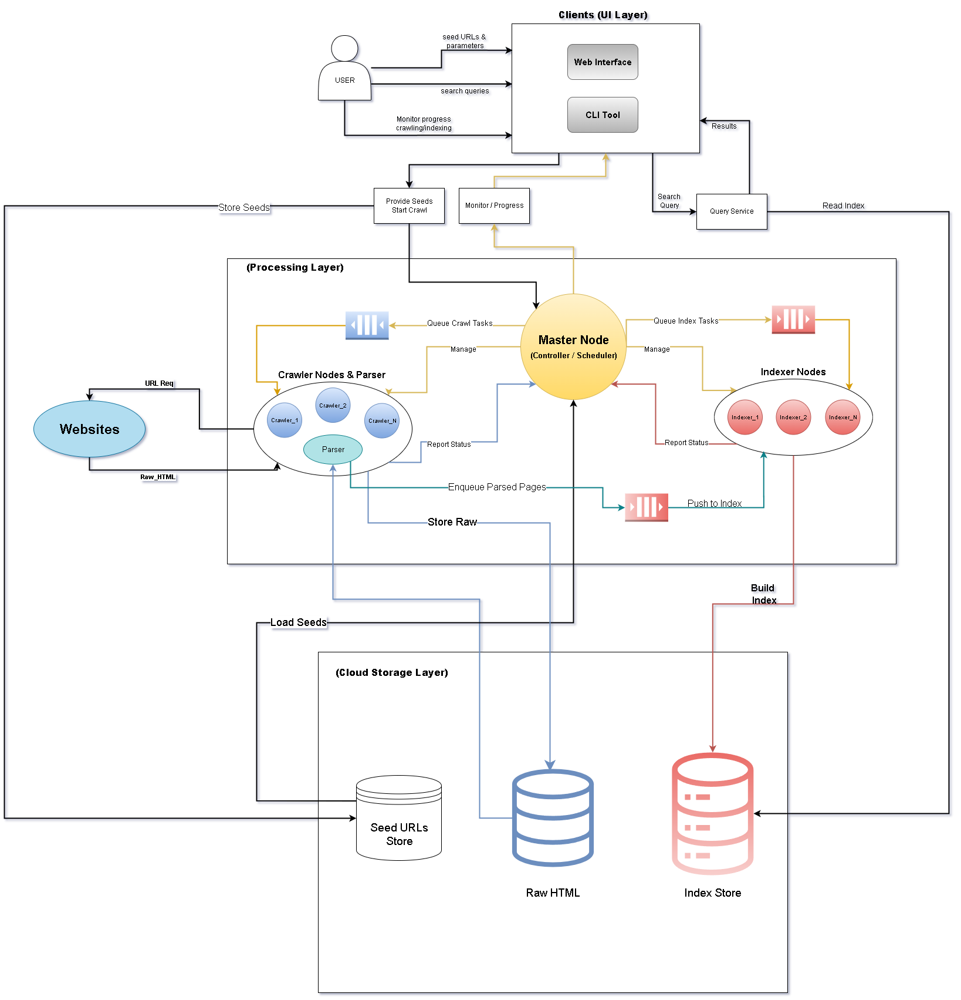
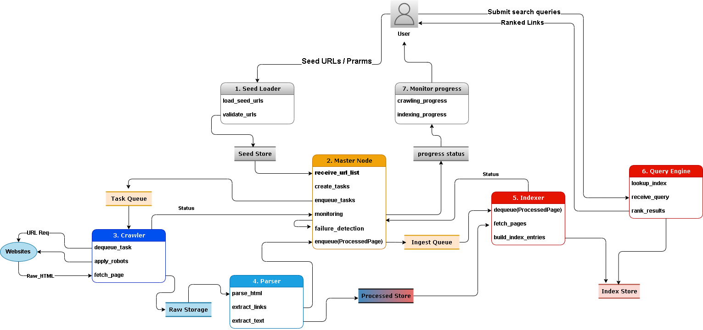
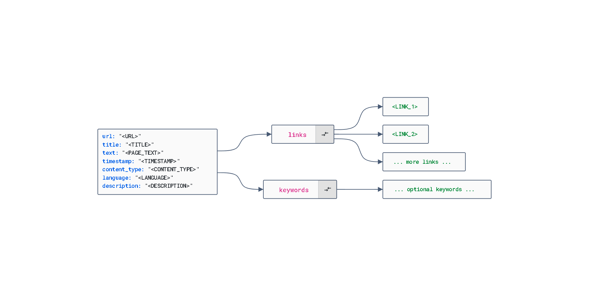
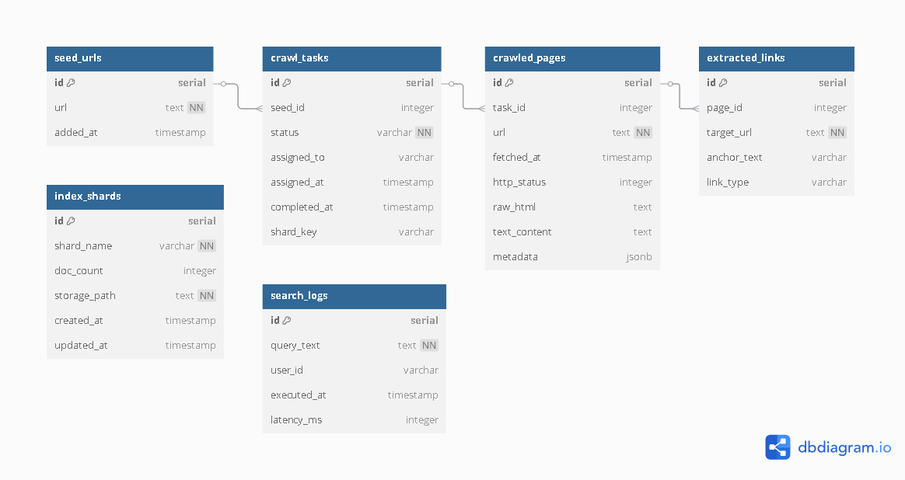
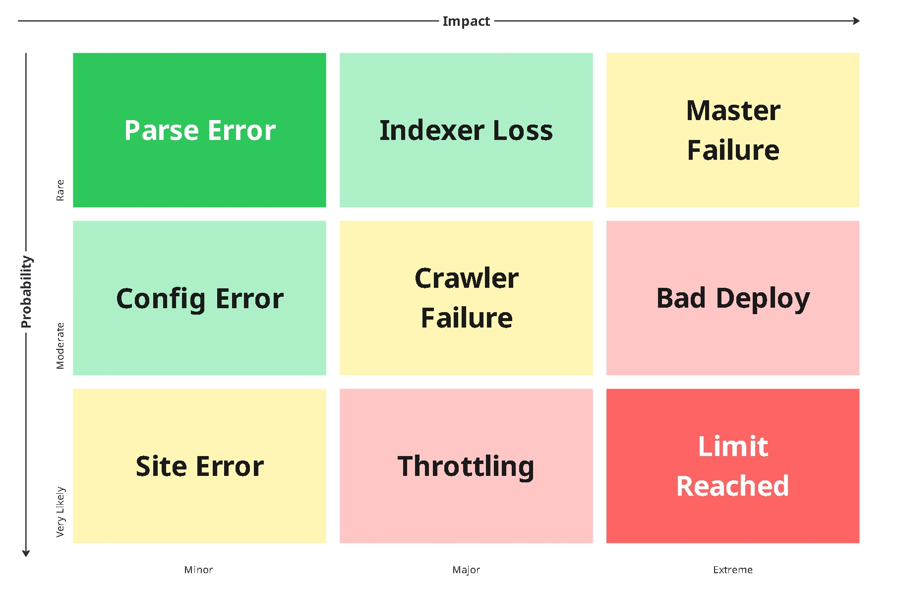
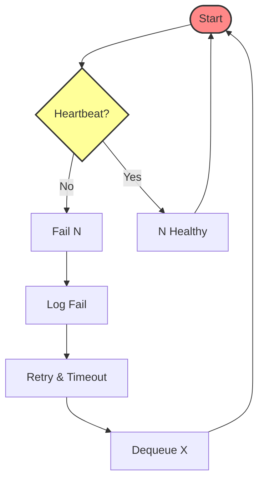

<p align="center"><strong><h5 style="text-align: center; font-size: large;">Ain Shams University Faculty of Engineering</h5></strong></p>
<p align="center"><strong><h5 style="text-align: center; font-size: large;">Computer Engineering and Software Systems</h5></strong></p>
<p align="center"><strong><h5 style="text-align: center; font-size: large;">Credit Hours Engineering Programs (iCHEP)</h5></strong></p>

<div align="center"> Course Name: <strong>Distributed Computing</strong> </div>
<div align="center"> Course Code: <strong>CSE354</strong> </div>
<div align="center"> Academic Year: <strong>Spring 2024</strong></div>

| Student Name                    | ID(ASU)     |
| ------------------------------- |:-----------:|
| **Omar Osama**                  | **2101757** |
| **Ahmed Mohamed Salah**         | **2100669** |
| **Ahmad Muhammad Abdelmaksoud** | **2101077** |
| **Belal Anas Seddik Awad**      | **21P0072** |

# Project: Distributed Web Crawling and Indexing System using Cloud Computing

**Submitted to:**

    **Dr. Ayman Bahaa**

    **Eng. A'laa and Ashraf**

<div style="page-break-before:always;"></div>

# Phase 1: Project Inception and Core Architecture

## Focus

- Establish project foundations
- Define and document core architecture
- Set up initial cloud infrastructure
- Plan tasks and timeline for the full development cycle

---

# Table of Contents

- [Roles](#roles)
- [Tech Stack Justification](#tech-stack-justification)
- [System Design](#system-design)
  - [Architecture Diagrams](#architecture-diagrams)
  - [Data Flow](#data-flow)
  - [API/Interface](#apiex-interface)
  - [Storage Schemas](#storage-schemas)
  - [Class Diagram](#class-diagram)
  - [Fault Tolerance](#fault-tolerance)
  - [Crawler Node Failover Logic](#crawler-node-failover-logic)
- [Detailed Project Planning](#detailed-project-planning)
- [Cloud Environment Setup (Basic)](#cloud-environment-setup-basic)
  - [Set Up Accounts with the Chosen Cloud Provider](#set-up-accounts-with-the-chosen-cloud-provider)
  - [Configure Basic Cloud Resources](#configure-basic-cloud-resources)
  - [Establish Basic Network Configurations](#establish-basic-network-configurations)
- [Initial Code Repository Setup](#initial-code-repository-setup)

<div style="page-break-before:always;"></div>

### 1. Roles

- Cloud and Testing: Omar Osama
- Crawler: Ahmed Ab
- Indexer: Ahmed Mohamed Salah 
- Architect: Belal Anas

---

### 2. Tech Stack Justification:

- **Scrapy:** Integrated async engine, scheduling, middleware, and politeness protocols enable efficient, large-scale crawling beyond basic libraries.

- **Elasticsearch:** Elasticsearch's node-based architecture is particularly well-suited for our distributed web crawling system, as it has these following properties:

  1. ***Distributed Architecture & Scalability***
    - Elasticsearch operates as a cluster of nodes (Elasticsearch instances)
    - Each node is a running instance of Elasticsearch that can:
      - Store data
      - Process search requests
      - Handle indexing operations
    - Nodes can be added or removed from the cluster dynamically
    - This distributed nature perfectly matches our project's need for scalable indexing
  
  2. ***Fault Tolerance Through Replication***
    - Elasticsearch uses a sharding system where:
      - Data is divided into shards (pieces)
      - Each shard has a primary copy and replica copies
      - Replicas are stored on different nodes
    - If an Elasticsearch node fails:
      - The primary shards on that node become unavailable
      - Replica shards on other nodes are automatically promoted to primary status
      - This ensures data remains accessible even during node failures
    - This built-in replication system helps us meet our project's fault tolerance requirements
  
  3. ***Advanced Search Capabilities***
    - Each Elasticsearch node can process search queries
    - Built-in support for:
      - Full-text search
      - Boolean queries
      - Phrase matching
      - Relevance scoring
    - This provides the robust search functionality required by our project
  
  4. ***Performance & Resource Management***
    - Each Elasticsearch node can:
      - Cache frequently accessed data
      - Process queries in parallel
      - Handle multiple indexing operations simultaneously
    - This ensures efficient processing of our crawled content
  
  5. ***Integration & Communication***
    - Elasticsearch nodes communicate through a REST API
    - Python client (elasticsearch-py) provides easy integration
    - Simple to connect our crawler nodes to the Elasticsearch cluster
    - Nodes can be added or removed without application changes
  
  6. ***Cloud Deployment***
    - Elasticsearch nodes can run on cloud VMs (like AWS EC2)
    - Each VM can host one or more Elasticsearch nodes
    - Example architecture:
      ```
      AWS EC2 Instance 1
      └── Elasticsearch Node 1 (Primary Shards)
      └── Elasticsearch Node 2 (Replica Shards)
    
      AWS EC2 Instance 2
      └── Elasticsearch Node 3 (Primary Shards)
      └── Elasticsearch Node 4 (Replica Shards)
      ```
    - This makes it easy to deploy in our cloud environment
  
  7. ***Monitoring & Health Checks***
    - Each Elasticsearch node reports its status
    - Built-in monitoring for:
      - Node health
      - Shard allocation
      - Indexing performance
      - Search performance
    - Helps us track system health and performance

- **Celery (with Redis):** 
  
  - **Deep Python Integration:** Celery is a Python-native framework, enabling seamless integration with the existing Python codebase (Scrapy, application logic) and leveraging Python's concurrency models (`asyncio`, threading, multiprocessing) effectively.
  - **Low-Latency Brokering:** Redis, as an in-memory data store, provides extremely fast message enqueue/dequeue operations, minimizing task scheduling overhead crucial for high-throughput crawling and indexing workloads.
  - **Rich Task Execution Control:** Celery offers application-level features beyond basic queuing (provided by cloud services like SQS/PubSub), including built-in support for task retries with backoff, rate limiting (essential for politeness), scheduled tasks (Celery Beat), and defining complex task workflows (chains, groups, chords).
  - **Flexible Result Backends:** While using Redis as a broker, Celery allows storing task results or state in various backends (including Redis itself, databases, or disabling it entirely), offering flexibility based on whether task return values are needed.
  - **Broker Decoupling:** Although chosen with Redis initially, Celery's architecture allows swapping the broker (e.g., to RabbitMQ or SQS) later with relatively minimal application code changes if requirements evolve.

- **AWS:** Offers a broad, mature, and integrated suite of managed infrastructure components (compute, storage, DBs, queues, ES) ensuring readily available, robust building blocks.

- **AWS RDS:** Delivers managed relational persistence with ACID guarantees, ensuring transactional integrity for critical state/metadata tracking over NoSQL alternatives.

---

<div style="page-break-before:always;"></div>

### 3. System Design
  The distributed web crawling and indexing system is designed with a focus on scalability, fault tolerance, and efficient data processing. The system architecture follows a master-worker pattern, where a central master node coordinates multiple crawler and indexer nodes. This design allows for parallel processing of web pages and distributed indexing, enabling the system to handle large-scale web crawling tasks efficiently.
  
  The system's components are distributed across cloud-based virtual machines, with each component having specific responsibilities:
  - The master node manages task distribution and monitors worker health
  - Crawler nodes handle web page fetching and content extraction
  - Indexer nodes process and store the crawled content in a searchable format
  - A distributed task queue ensures reliable communication between components
  - Cloud storage provides persistent data storage for crawled content and indexes
  
  This architecture enables the system to scale horizontally by adding more worker nodes as needed, while maintaining fault tolerance through replication and task redistribution mechanisms.
- **Architecture Diagrams**:
  
  

<div style="page-break-before:always;"></div>

- **Data Flow**:
  
  

- **API/Interface:**

- **API/Interface:**
  

<div style="page-break-before:always;"></div>

- **Storage Schemas**
  
  

- **Class Diagram**

<div style="page-break-before:always;"></div>

- **Fault Tolerance**
  
  
  
  * **Parse Error:** A single webpage's structure causes a parser instance to fail; recovery is typically automatic with minimal impact.
  * **Indexer Loss:** An indexer node fails losing in-progress index updates before they are stored; requires reprocessing from the queue.
  * **Master Failure:** Complete failure of the central Master Node, halting crawl coordination, scheduling, and monitoring.
  * **Config Error:** Incorrect configuration of a parameter, potentially causing suboptimal performance but not failure.
  * **Crawler Failure:** An individual crawler node crashes or becomes unresponsive, stalling its current tasks until retried via the queue.
  * **Bad Deploy:** Deployment of software with a critical bug, potentially causing widespread data corruption or operational failure.
  * **Site Error:** Target website is temporarily unavailable or returns errors (e.g., 503 Service Unavailable); handled via standard crawler retry mechanisms.
  * **Throttling:** Sustained network throttling or rate-limiting imposed by target websites due to overly aggressive crawling.
  * **Limit Reached:** Exceeding the capacity of a core resource (storage, database, queue), potentially leading to system-wide failure.
  
  <div style="page-break-before:always;"></div>

- **Crawler Node Failover logic:**



<div style="page-break-before:always;"></div>

---

### 4. Detailed Project Planning

- phases into sub-tasks (jira issues)
- tasks to team members
- Gantt chart:
  - Task durations
  - Dependencies
  - Milestones for each phase

---

### 5. Cloud Environment Setup (Basic)

#### 5.1. Set Up Accounts with the Chosen Cloud Provider

The cloud environment for this project was set up using **Amazon Web Services (AWS)**. To begin, an AWS account was created, enabling access to various cloud resources, including virtual machines (EC2) and storage (S3).

- **AWS Account**: Created through the AWS Console, providing access to various services necessary for the project.

#### 5.2. Configure Basic Cloud Resources

##### a) Virtual Machines (EC2 Instances)

Three Amazon EC2 instances were created to serve as the **Master Node**, **Crawler Node**, and **Indexer Node**:

- **Master Node**: 
  - EC2 instance responsible for managing the entire web crawling process. It coordinates the crawling tasks and sends them to the Crawler Node.
- **Crawler Node**:
  - EC2 instance responsible for fetching web pages based on URLs provided by the Master Node. It stores the crawled HTML content in **S3**.
- **Indexer Node**:
  - EC2 instance responsible for processing the crawled HTML content, extracting relevant data, and creating a search index, which is then stored in **S3**.

##### b) Storage Service (S3)

**S3 (Simple Storage Service)** was used for persistent storage. Two primary buckets were created:

1. **raw/**:
   - Stores the raw HTML content crawled from websites by the Crawler Node.
2. **index/**:
   - Stores the index files (`index.json`) generated by the Indexer Node.

#### 5.3. Establish Basic Network Configurations

To ensure smooth communication between the VMs and AWS services:

##### a) Security Groups

- **Security Groups** were configured to allow traffic between the EC2 instances, ensuring they could communicate with each other securely. Specific inbound rules were set for:
  - **SSH access** (port 22) from trusted IP addresses (for administrative access).
  - **Internal traffic** between EC2 instances (e.g., for HTTP communication between nodes or custom ports for your application).

##### b) IAM Roles

- **IAM Roles** were assigned to each EC2 instance to provide them with necessary permissions to interact with **S3** (for storage), **SQS** (for task management), and other AWS services securely.

##### c) Instance Metadata Service (IMDS)

- **IMDS** was enabled to allow EC2 instances to automatically fetch credentials when interacting with AWS services, making it easier to manage access permissions without manually handling API keys.

---

### 6. Initial Code Repository Setup

```shell
├── requirements.txt     # Python dependencies
├── config/              # Configuration files
│   └── settings.yaml    
├── src/                 # Main source code
│   ├── crawler/         
│   ├── indexer/         
│   ├── master/          
│   ├── common/          # Shared code (utils, data models)
│   └── main.py          # Entry point
├── tests/               # Unit and Integration tests
│   ├── test_x.py 
├── scripts/             # Helper scripts (deployment, setup, etc.)
│   └── start_x.py   
└── docs/                # Project documentation
    └── architecture.md  # Detailed architecture description
```
