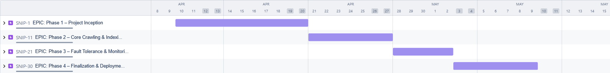
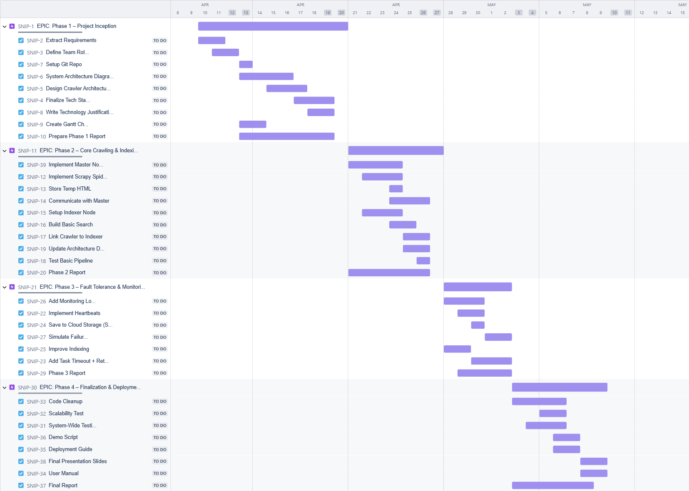

<p align="center"><strong><h5 style="text-align: center; font-size: large;">Ain Shams University Faculty of Engineering</h5></strong></p>
<p align="center"><strong><h5 style="text-align: center; font-size: large;">Computer Engineering and Software Systems</h5></strong></p>
<p align="center"><strong><h5 style="text-align: center; font-size: large;">Credit Hours Engineering Programs (iCHEP)</h5></strong></p>

<div align="center"> Course Name: <strong>Distributed Computing</strong> </div>
<div align="center"> Course Code: <strong>CSE354</strong> </div>
<div align="center"> Academic Year: <strong>Spring 2024</strong></div>

| Student Name                    | ID(ASU)     |
| ------------------------------- |:-----------:|
| **Omar Osama**                  | **2101757** |
| **Ahmed Mohamed Salah**         | **2100669** |
| **Ahmad Muhammad Abdelmaksoud** | **2101077** |
| **Belal Anas Seddik Awad**      | **21P0072** |

# Project: Distributed Web Crawling and Indexing System using Cloud Computing

**Submitted to:**

    **Dr. Ayman Bahaa**

    **Eng. A'laa and Ashraf**

<div style="page-break-before:always;"></div>

# Phase 1: Project Inception and Core Architecture

## Focus

- Establish project foundations
- Define and document core architecture
- Set up initial cloud infrastructure
- Plan tasks and timeline for the full development cycle

---

# Table of Contents

- [Roles](#roles)
- [Tech Stack Justification](#tech-stack-justification)
- [System Design](#system-design)
  - [Architecture Diagrams](#architecture-diagrams)
  - [Data Flow](#data-flow)
  - [API/Interface](#apiex-interface)
  - [Storage Schemas](#storage-schemas)
  - [Class Diagram](#class-diagram)
  - [Fault Tolerance](#fault-tolerance)
  - [Crawler Node Failover Logic](#crawler-node-failover-logic)
- [Detailed Project Planning](#detailed-project-planning)
- [Cloud Environment Setup (Basic)](#cloud-environment-setup-basic)
  - [Set Up Accounts with the Chosen Cloud Provider](#set-up-accounts-with-the-chosen-cloud-provider)
  - [Configure Basic Cloud Resources](#configure-basic-cloud-resources)
  - [Establish Basic Network Configurations](#establish-basic-network-configurations)
- [Initial Code Repository Setup](#initial-code-repository-setup)

<div style="page-break-before:always;"></div>

### 1. Roles

- Cloud and Testing: Omar Osama
- Crawler: Ahmed Muhammad 
- Indexer: Ahmed Mohamed Salah 
- Architect: Belal Anas

---

##### 2. Tech Stack Justification

The technology stack was carefully selected to ensure scalability, fault tolerance, cloud compatibility, and efficient content crawling and indexing.  
Each tool was chosen based on its strengths in distributed system design, data processing, and cloud deployment.

---

#### - **Scrapy (Crawler Framework with Extraction and Preprocessing)**

Scrapy was selected as the primary framework for crawling web content and preparing extracted data for indexing.

- **Asynchronous Architecture:** Supports large-scale concurrent crawling efficiently.

- **XPath Extraction via Item Loaders:** Enables precise targeting of relevant user-interest text such as headings, paragraphs, and sections.

- **Integrated Preprocessing Pipeline:** Includes text cleaning, whitespace normalization, and fallback handling within the Item Loader system.

- **Built-in Retry and Politeness Control:** Handles retries, timeouts, and respects `robots.txt` directives natively.

- **Cloud and Task Queue Readiness:** Modular structure supports future integration with AWS and task distribution frameworks.

---

#### - **Readability-lxml (Optional Content Extraction Enhancement)**

An optional module used in an experimental crawler node to improve robustness for unstructured web pages.

- **Content-Density Analysis:** Isolates main article content automatically.

- **Flexibility:** Allows handling of blog posts, news articles, and long-form content without manual targeting.

---

#### - **Elasticsearch (Distributed Indexing and Search Engine)**

Elasticsearch was selected as the core engine for indexing and querying crawled content due to its distributed nature and rich query capabilities.

- **Distributed Architecture:** Nodes store shards and handle parallel indexing/search operations.

- **Fault Tolerance through Shard Replication:** Ensures high availability during node failures.

- **Advanced Search Capabilities:** Full-text search, boolean queries, phrase matching, relevance scoring.

- **Resource Efficiency:** Supports query caching, parallel processing, and efficient memory use.

- **RESTful API and Python Client Integration:** Easy communication with crawler and indexer nodes.

- **Cloud Deployment Flexibility:** Easily runs on AWS EC2 instances with elastic scaling.

- **Monitoring and Health Checks:** Built-in support for tracking cluster status and performance.

---

#### - **Celery with Redis (Task Queue and Asynchronous Coordination)**

Celery combined with Redis was chosen for distributed task management between system components.

- **Deep Python Integration:** Native Python concurrency support (threading, multiprocessing, asyncio).

- **Low-Latency Messaging:** Redis offers fast, in-memory message brokering for task dispatch.

- **Rich Task Control:** Built-in retries, rate limiting, scheduling (Celery Beat), and task chaining.

- **Flexible Result Handling:** Optional task result backends for success/failure tracking.

- **Broker Independence:** Can switch brokers easily (RabbitMQ, SQS) if future scaling requires.

---

#### - **AWS (Cloud Infrastructure)**

Amazon Web Services was selected to host the distributed components due to its robust, mature infrastructure.

- **Managed Compute Resources (EC2):** Scalable virtual machines to run crawler and indexer nodes.

- **Elastic Storage (S3):** Reliable storage of crawled data and backups.

- **Scalable Databases (RDS, OpenSearch):** Flexible relational and search database services.

- **Integrated Monitoring and IAM Security:** Built-in service monitoring, alarms, and fine-grained access control.

---

#### - **AWS RDS (Managed Relational Database Service)**

AWS RDS was selected for managing critical state tracking and metadata storage.

- **Transactional Integrity (ACID):** Ensures reliability and consistency of system-critical metadata.

- **Automatic Backups and Scaling:** Enables fault tolerance and vertical scaling without downtime.

- **Simplified Management:** Reduces administrative overhead for database maintenance.

---

<div style="page-break-before:always;"></div>

### 3. System Design

  The distributed web crawling and indexing system is designed with a focus on scalability, fault tolerance, and efficient data processing. The system architecture follows a master-worker pattern, where a central master node coordinates multiple crawler and indexer nodes. This design allows for parallel processing of web pages and distributed indexing, enabling the system to handle large-scale web crawling tasks efficiently.

  The system's components are distributed across cloud-based virtual machines, with each component having specific responsibilities:

- The master node manages task distribution and monitors worker health

- Crawler nodes handle web page fetching and content extraction

- Indexer nodes process and store the crawled content in a searchable format

- A distributed task queue ensures reliable communication between components

- Cloud storage provides persistent data storage for crawled content and indexes
  
  This architecture enables the system to scale horizontally by adding more worker nodes as needed, while maintaining fault tolerance through replication and task redistribution mechanisms.
  
  - **Architecture Diagrams**:
  
  

<div style="page-break-before:always;"></div>

- **Data Flow**:
  
  

- **API/Interface:**
## 


## 1. Client ↔ Master API

### 1.1 Start Crawl

**Endpoint:**

```
POST /api/v1/crawls
```

- **Purpose:**  
  Create a new `<Job>`

- **Request Body (JSON):**
  
  ```json
  {
    "seedUrls": ["http://example.com", "http://example.org"],
    "parameters": {
      "crawlDepth": <num>,
      "domainRestrictions": ["example.com"],
      "politenessDelayMs": <num>,
      "userAgent": "MyCrawler/1.0"
    }
  }
  ```

- **Success Response (202 Accepted):**
  
  ```json
  {
    "id": "<uuid>",
    "status": "<PENDING|RUNNING>",
    "meta": { … }
  }
  ```

- **Error Responses:**
  
  | HTTP Code | Scenario                      | Body Example                                                    |
  | --------- | ----------------------------- | --------------------------------------------------------------- |
  | 400       | Invalid or missing parameters | `{ "error":"BadRequest","message":"Missing seedUrls" }`         |
  | 500       | Master node internal error    | `{ "error":"InternalError","message":"Unable to queue crawl" }` |

---

### 1.2 Monitor Crawl Status

**Endpoint:**

```
GET /api/v1/crawls/{crawlId}/status
```

- **Purpose:**  
  Read status & metrics for `<Job>`

- **Path Parameters:**
  
  | Name    | In   | Type   | Required | Description                |
  | ------- | ---- | ------ | -------- | -------------------------- |
  | crawlId | path | string | yes      | Unique ID of the crawl job |

- **Success Response (200 OK):**
  
  ```json
  {
    "id": "<uuid>",
    "status": "<PENDING|RUNNING|SUCCEEDED|FAILED>",
    "metrics": { … },
    "timestamps": { "created": "<ISO>", "updated": "<ISO>" }
  }
  ```

- **Error Responses:**
  
  | HTTP Code | Scenario                   | Body Example                                                     |
  | --------- | -------------------------- | ---------------------------------------------------------------- |
  | 404       | crawlId not found          | `{ "error":"NotFound","message":"Crawl job not found" }`         |
  | 500       | Master node internal error | `{ "error":"InternalError","message":"Unable to fetch status" }` |

---

## 2. Worker ↔ Master API

### 2.1 Register Worker

**Endpoint:**

```
POST /api/v1/workers/register
```

- **Purpose:**  
  Register or heartbeat worker

- **Request Body (JSON):**
  
  ```json
  {
    "workerId": "<string>",
    "type": "<CRAWLER|INDEXER>",
    "address": "<host:port>",
    "capabilities": { … }    // optional for heartbeat
  }
  ```

- **Success Response (204 No Content):**  
  *No body.*

- **Error Responses:**
  
  | HTTP Code | Scenario                  | Body Example                                                   |
  | --------- | ------------------------- | -------------------------------------------------------------- |
  | 400       | Missing or invalid fields | `{ "error":"BadRequest","message":"Missing nodeType" }`        |
  | 409       | nodeId already registered | `{ "error":"Conflict","message":"Worker already registered" }` |

---

### 2.2 Send Heartbeat

**Endpoint:**

```
POST /api/v1/workers/{workerId}/heartbeat
```

- **Purpose:**  
  Signal to the Master that the worker node is still alive.

- **Path Parameters:**
  
  | Name     | In   | Type   | Required | Description                  |
  | -------- | ---- | ------ | -------- | ---------------------------- |
  | workerId | path | string | yes      | Unique ID of the worker node |

- **Request Body:**  
  *(Empty JSON object)*
  
  ```json
  {}
  ```

- **Success Response (204 No Content):**  
  *No body.*

- **Error Responses:**
  
  | HTTP Code | Scenario                | Body Example                                               |
  | --------- | ----------------------- | ---------------------------------------------------------- |
  | 404       | workerId not registered | `{ "error":"NotFound","message":"Worker not registered" }` |

---

### 2.3 Report Status / Update

**Endpoint:**

```
POST /api/v1/workers/{workerId}/status
```

- **Purpose:**  
  Report current status & results

- **Path Parameters:**
  
  | Name     | In   | Type   | Required | Description                  |
  | -------- | ---- | ------ | -------- | ---------------------------- |
  | workerId | path | string | yes      | Unique ID of the worker node |

- **Request Body (JSON):**
  
  - **Crawler example:**
    
    ```json
    {
      "status": "IDLE",
      "metrics": {
        "processedTasks": 150,
        "avgLatencyMs": 350
      },
      "newUrlsDiscovered": [
        "http://example.com/new-page",
        "http://othersite.org/"
      ]
    }
    ```
  
  - **Indexer example:**
    
    ```json
    {
      "status": "BUSY",
      "currentTask": "indexing-doc-xyz",
      "metrics": {
        "docsIndexedSinceLast": 10
      }
    }
    ```

- **Success Response (204 No Content):**  
  *No body.*

- **Error Responses:**
  
  | HTTP Code | Scenario               | Body Example                                                |
  | --------- | ---------------------- | ----------------------------------------------------------- |
  | 400       | Invalid status payload | `{ "error":"BadRequest","message":"Unknown status value" }` |
  | 404       | workerId not found     | `{ "error":"NotFound","message":"Worker not registered" }`  |

---

## 3. Client ↔ Query Service API

### 3.1 Submit Search Query

**Endpoint:**

```
GET /api/v1/search
```

- **Purpose:**  
  Execute a search against the built index and return ranked results.

- **Query Parameters:**
  
  | Name   | In    | Type   | Required | Default | Description                         |
  | ------ | ----- | ------ | -------- | ------- | ----------------------------------- |
  | q      | query | string | yes      | —       | Search query (e.g. `web+crawler`)   |
  | limit  | query | int    | no       | 10      | Maximum number of results to return |
  | offset | query | int    | no       | 0       | Pagination offset                   |

- **Success Response (200 OK):**
  
  ```json
  {
    "query": "web crawler architecture",
    "results": [
      {
        "title": "Building a Distributed Web Crawler",
        "url": "http://example-blog.com/crawler-design",
        "snippet": "...key components of a scalable web crawler architecture...",
        "score": 0.85
      },
      {
        "title": "Web Crawling - Wikipedia",
        "url": "https://en.wikipedia.org/wiki/Web_crawler",
        "snippet": "A Web crawler, sometimes called a spider or spiderbot…",
        "score": 0.72
      }
    ],
    "totalHits": 1250,
    "queryTimeMs": 45
  }
  ```

- **Error Responses:**
  
  | HTTP Code | Scenario              | Body Example                                                         |
  | --------- | --------------------- | -------------------------------------------------------------------- |
  | 400       | Missing or empty `q`  | `{ "error":"BadRequest","message":"Query parameter q is required" }` |
  | 500       | Query service failure | `{ "error":"InternalError","message":"Search index unavailable" }`   |


- **JSON:**
  

<div style="page-break-before:always;"></div>

- **Storage Schemas**
  
  

- **Class Diagram**

<div style="page-break-before:always;"></div>

- **Fault Tolerance**
  
  
  
  * **Parse Error:** A single webpage's structure causes a parser instance to fail; recovery is typically automatic with minimal impact.
  * **Indexer Loss:** An indexer node fails losing in-progress index updates before they are stored; requires reprocessing from the queue.
  * **Master Failure:** Complete failure of the central Master Node, halting crawl coordination, scheduling, and monitoring.
  * **Config Error:** Incorrect configuration of a parameter, potentially causing suboptimal performance but not failure.
  * **Crawler Failure:** An individual crawler node crashes or becomes unresponsive, stalling its current tasks until retried via the queue.
  * **Bad Deploy:** Deployment of software with a critical bug, potentially causing widespread data corruption or operational failure.
  * **Site Error:** Target website is temporarily unavailable or returns errors (e.g., 503 Service Unavailable); handled via standard crawler retry mechanisms.
  * **Throttling:** Sustained network throttling or rate-limiting imposed by target websites due to overly aggressive crawling.
  * **Limit Reached:** Exceeding the capacity of a core resource (storage, database, queue), potentially leading to system-wide failure.
  
  <div style="page-break-before:always;"></div>

- **Crawler Node Failover logic:**


<div style="page-break-before:always;"></div>

---

### 4. Detailed Project Planning

The project planning was managed using **Jira** to ensure structured task tracking, proper role assignments, and timeline visualization.  

The work was broken down into manageable tasks for each phase, aligned with a Gantt-style roadmap spanning 8 weeks.

---

### Task Breakdown

#### Phase 1 – Project Inception

| Task                           | Assigned To  | Timeline    |
| ------------------------------ | ------------ | ----------- |
| Extract Requirements           | Team shared  | 10–11 April |
| Define Team Roles              | Team shared  | 11–12 April |
| Setup Git Repo                 | Architect    | 13 April    |
| System Architecture Diagrams   | Architect    | 13–16 April |
| Design Crawler Architecture    | Crawler Lead | 15–17 April |
| Finalize Tech Stack            | Architect    | 17–19 April |
| Write Technology Justification | Team shared  | 18–19 April |
| Create Gantt Chart             | Team shared  | 13–14 April |
| Prepare Phase 1 Report         | Team shared  | 13–19 April |

---

### Timeline (Gantt Chart View)

> The project tasks were organized into a timeline using **Jira Roadmaps**, showing parallel development efforts across Phases 1 and 2.  
> 
> Tasks were scheduled with clear start and end dates, ensuring each team member's workload was balanced.

**Timeline Screenshot:**





### Milestones

| Milestone          | Description                                   | Target Date   |
| ------------------ | --------------------------------------------- | ------------- |
| Phase 1 Completion | Project inception and tech stack finalized    | 19 April 2025 |
| Phase 2 Completion | Basic crawling and indexing functional        | 27 April 2025 |
| Phase 3 Completion | Fault tolerance and cloud storage integration | 2 May 2025    |
| Phase 4 Completion | Final deployment and documentation            | 9 May 2025    |

---

### 5. Cloud Environment Setup (Basic)

#### 5.1. Set Up Accounts with the Chosen Cloud Provider

The cloud environment for this project was set up using **Amazon Web Services (AWS)**. To begin, an AWS account was created, enabling access to various cloud resources, including virtual machines (EC2) and storage (S3).

- **AWS Account**: Created through the AWS Console, providing access to various services necessary for the project.

#### 5.2. Configure Basic Cloud Resources

##### a) Virtual Machines (EC2 Instances)

Three Amazon EC2 instances were created to serve as the **Master Node**, **Crawler Node**, and **Indexer Node**:

- **Master Node**: 
  - EC2 instance responsible for managing the entire web crawling process. It coordinates the crawling tasks and sends them to the Crawler Node.
- **Crawler Node**:
  - EC2 instance responsible for fetching web pages based on URLs provided by the Master Node. It stores the crawled HTML content in **S3**.
- **Indexer Node**:
  - EC2 instance responsible for processing the crawled HTML content, extracting relevant data, and creating a search index, which is then stored in **S3**.

##### b) Storage Service (S3)

**S3 (Simple Storage Service)** was used for persistent storage. Two primary buckets were created:

1. **raw/**:
   - Stores the raw HTML content crawled from websites by the Crawler Node.
2. **index/**:
   - Stores the index files (`index.json`) generated by the Indexer Node.

#### 5.3. Establish Basic Network Configurations

To ensure smooth communication between the VMs and AWS services:

##### a) Security Groups

- **Security Groups** were configured to allow traffic between the EC2 instances, ensuring they could communicate with each other securely. Specific inbound rules were set for:
  - **SSH access** (port 22) from trusted IP addresses (for administrative access).
  - **Internal traffic** between EC2 instances (e.g., for HTTP communication between nodes or custom ports for your application).

##### b) IAM Roles

- **IAM Roles** were assigned to each EC2 instance to provide them with necessary permissions to interact with **S3** (for storage), **SQS** (for task management), and other AWS services securely.

##### c) Instance Metadata Service (IMDS)

- **IMDS** was enabled to allow EC2 instances to automatically fetch credentials when interacting with AWS services, making it easier to manage access permissions without manually handling API keys.

---

### 6. Initial Code Repository Setup

```shell
├── requirements.txt     # Python dependencies
├── config/              # Configuration files
│   └── settings.yaml    
├── src/                 # Main source code
│   ├── crawler/         
│   ├── indexer/         
│   ├── master/          
│   ├── common/          # Shared code (utils, data models)
│   └── main.py          # Entry point
├── tests/               # Unit and Integration tests
│   ├── test_x.py 
├── scripts/             # Helper scripts (deployment, setup, etc.)
│   └── start_x.py   
└── docs/                # Project documentation
    └── architecture.md  # Detailed architecture description
```
