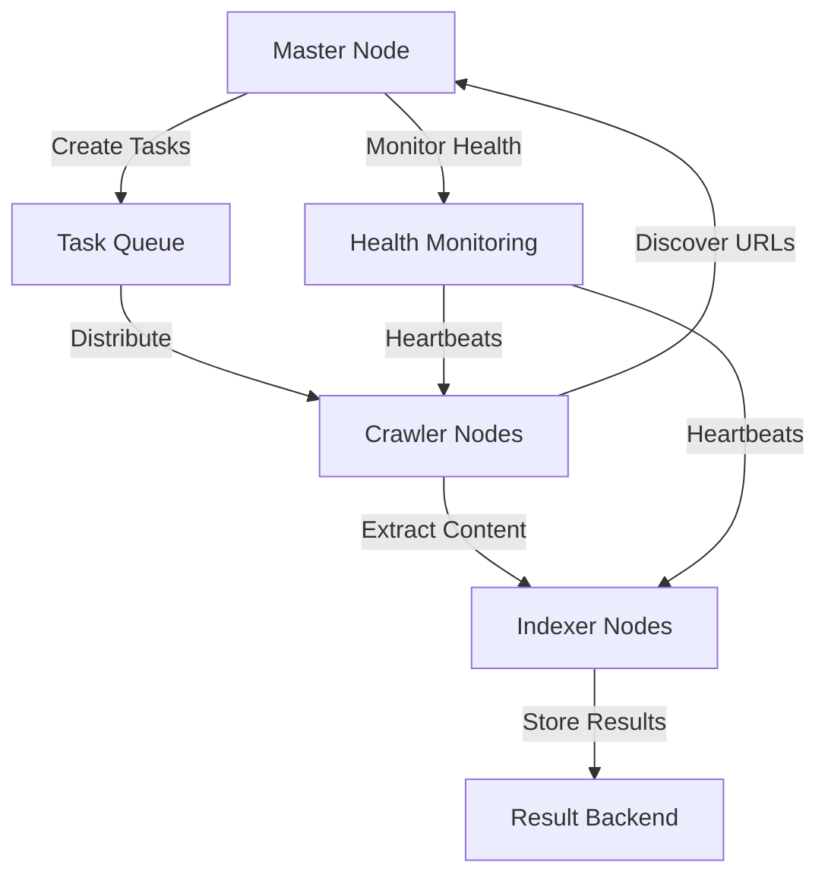

<p align="center"><strong><h5 style="text-align: center; font-size: large;">Ain Shams University Faculty of Engineering</h5></strong></p>
<p align="center"><strong><h5 style="text-align: center; font-size: large;">Computer Engineering and Software Systems</h5></strong></p>
<p align="center"><strong><h5 style="text-align: center; font-size: large;">Credit Hours Engineering Programs (iCHEP)</h5></strong></p>

<div align="center"> Course Name: <strong>Distributed Computing</strong> </div>
<div align="center"> Course Code: <strong>CSE354</strong> </div>
<div align="center"> Academic Year: <strong>Spring 2024</strong></div>

| Student Name                    | ID(ASU)     |
| ------------------------------- |:-----------:|
| **Omar Osama**                  | **2101757** |
| **Ahmed Mohamed Salah**         | **2100669** |
| **Ahmad Muhammad Abdelmaksoud** | **2101077** |
| **Belal Anas Seddik Awad**      | **21P0072** |

# Project: Distributed Web Crawling and Indexing System using Cloud Computing

**Submitted to:**

    **Dr. Ayman Bahaa**

    **Eng. A'laa and Ashraf**

<div style="page-break-before:always;"></div>

# Phase 2: Distributed Web Crawling and Indexing System

## Objective

- **Pipeline**: Master distributes URLs to Crawlers via message queue.

- **Crawler**: Fetch pages, extract links/text, follow politeness.

- **Communication**: Crawlers send URLs, status, and content via queues.

- **Indexer**: Store page content in a searchable index.

- **Integration**: Connect all components into a working system.

---

**Table of Contetns**

1. [Component Implementation Details](#1-component-implementation-details)
   - [Master Node](#11-master-node)
   - [Crawler Node(s)](#12-crawler-nodes)
   - [Indexer Node](#13-indexer-node)
   - [Task Queues](#14-task-queues)
2. [Integration and Workflow](#2-integration-and-workflow)
3. [Testing and Results](#3-testing-and-results)

---

## 1. Component Implementation Details

### 1.1. Master Node

* **Task Distribution:**
  
  - Implements batch processing with configurable batch size (default: 10 URLs per batch)
  - Uses Celery task queue for distributed task assignment
  - Maintains separate queues for crawlers and indexers
  - Implements task deduplication using sets (urls_to_crawl, processing_urls, completed_urls)
  - Features automatic task reassignment on node failures
  - Tracks task status and results using AsyncResult objects

* **Result Handling:** 
  
  - Processes completed tasks asynchronously
  - Extracts new URLs from crawled pages
  - Updates task metrics (created, completed, failed)
  - Maintains URL state (to crawl, processing, completed)
  - Implements error handling and recovery
  - Logs detailed task completion status and metrics

* **Libraries Used:** 
  
  - `mpi4py`: For distributed computing and node communication
  - `celery`: For task queue management and distribution
  - `redis`: As message broker and result backend
  - `logging`: For comprehensive system logging
  - `typing`: For type hints and code documentation
  - `uuid`: For generating unique task and batch IDs
  - `time`: For timing operations and heartbeat management

* **Code Snippet:**
  
  ```python
  class MasterNode:
      def __init__(self):
          # MPI setup
          self.comm = MPI.COMM_WORLD
          self.rank = self.comm.Get_rank()
          self.size = self.comm.Get_size()
  
          # Task management
          self.urls_to_crawl: Set[str] = set()
          self.processing_urls: Set[str] = set()
          self.completed_urls: Set[str] = set()
          self.task_results: Dict[str, AsyncResult] = {}
          self.batch_size = 10
  
          # Performance metrics
          self.metrics = {
              'tasks_created': 0,
              'tasks_completed': 0,
              'tasks_failed': 0,
              'urls_discovered': 0,
              'node_failures': 0,
              'start_time': time.time()
          }
  
      def assign_tasks_to_crawlers(self, batch: List[str]) -> None:
          """Assign a batch of URLs to crawler nodes via the task queue."""
          if not batch:
              return
  
          batch_id = str(uuid.uuid4())
          logger.info(f"Assigning batch {batch_id} with {len(batch)} URLs to crawlers")
  
          # Create tasks for the batch
          tasks = []
          for url in batch:
              task_id = str(uuid.uuid4())
              task = crawl_url.apply_async(
                  args=[url, task_id],
                  queue=self.crawler_queue,
                  task_id=task_id
              )
              tasks.append(task)
              self.task_results[task_id] = task
              self.metrics['tasks_created'] += 1
  
      def process_task_results(self):
          """Process completed task results."""
          completed_tasks = []
  
          for task_id, result in self.task_results.items():
              if result.ready():
                  try:
                      task_result = result.get()
  
                      # Process new URLs
                      if 'new_urls' in task_result:
                          new_urls = set(task_result['new_urls']) - self.completed_urls - self.processing_urls
                          self.urls_to_crawl.update(new_urls)
                          self.metrics['urls_discovered'] += len(new_urls)
  
                      # Update URL states
                      if 'url' in task_result:
                          self.completed_urls.add(task_result['url'])
                          self.processing_urls.discard(task_result['url'])
                          self.metrics['tasks_completed'] += 1
  
                      completed_tasks.append(task_id)
  
                  except Exception as e:
                      logger.error(f"Error processing task {task_id}: {e}")
                      self.metrics['tasks_failed'] += 1
                      completed_tasks.append(task_id)
  
          # Cleanup completed tasks
          for task_id in completed_tasks:
              del self.task_results[task_id]
  ```

* **Key Features:**
  
  - Distributed task processing using MPI
  - Asynchronous task execution with Celery
  - Robust error handling and recovery
  - Comprehensive performance metrics
  - Detailed logging and monitoring
  - Automatic task reassignment on failures
  - Efficient URL deduplication
  - Configurable batch processing

* **Performance Considerations:**
  
  - Uses sets for O(1) URL lookup and deduplication
  - Implements batch processing to reduce overhead
  - Maintains task state for efficient tracking
  - Implements heartbeat system for node health monitoring
  - Features automatic cleanup of completed tasks
  - Provides detailed metrics for performance monitoring

### 1.2. Crawler Node(s)

The Crawler Node is responsible for retrieving web pages, extracting relevant content, and transmitting structured data to the indexing layer.

---

#### **Fetching**

The crawler node uses Scrapy's asynchronous request handling to fetch URLs efficiently.  
Requests are generated from the `start_urls` list or dynamically received from the task queue (future work).  
Scrapy internally manages concurrent connections and handles retries, failures, and timeouts natively.

---

#### **Parsing & Extraction**

After fetching, the crawler parses the HTML response using XPath selectors.  
Relevant content such as page titles, headings, paragraphs, and article sections are extracted while avoiding scripts, navbars, and footers.  
The `ItemLoader` mechanism is used to clean and organize extracted data fields, applying input processors like `clean_whitespace_in()` for normalization.

Fields extracted include:

- `url`
- `title`
- `description`
- `keywords`
- `text`
- `links`
- `timestamp`
- `content_type`
- `language`

---

#### **Politeness**

Politeness policies are enforced through:

- **Crawl Delays:** Scrapy's settings allow setting download delays between consecutive requests.
- **Robots.txt Compliance:** Scrapy automatically respects `robots.txt` directives if enabled.
- **Retry Handling:** Failed requests are retried with exponential backoff by default.
- **Concurrency Limits:** Maximum concurrent requests can be tuned to avoid overloading target servers.

---

#### **Data Transmission**

Extracted and cleaned data is serialized into a structured JSON format.  
In the current phase, the crawler outputs to a local file (`temp.json`).  
In future phases, this data will be transmitted through cloud queues (e.g., AWS SQS) to indexer nodes for real-time processing.

---

#### **Libraries Used**

- **Scrapy:** Core crawling and extraction engine.
- **itemloaders:** Structured data loading and processing within Scrapy.
- **lxml:** Parsing HTML trees (Scrapy dependency).
- **readability-lxml (optional, crawlerR):** For experimental smart content extraction (not in main crawlerI).

---

#### **Code Snippet**

```python
    def parse(self, response):
        loader = ItemLoader(item=SnipdexItem(), response=response)
        loader.add_value("url", response.url)
        loader.add_xpath("title", "//title/text()")
        loader.add_xpath("description", "//meta[@name='description']/@content")
        if not loader.get_output_value("description"):
            loader.add_xpath("description", "//meta[@property='og:description']/@content")
        loader.add_xpath("keywords", "//meta[@name='keywords']/@content")
        if not loader.get_output_value("keywords"):
            loader.add_xpath("keywords", "//meta[@property='article:tag']/@content")
        text_xpath = """
        //body//*[not(self::script) and not(self::style)]
                 [not(ancestor::script) and not(ancestor::style) 
                  and not(ancestor::nav) and not(ancestor::footer) 
                  and not(ancestor::header)]
                 /text()
        """
        loader.add_xpath("text", text_xpath)
        loader.add_css("links", "a::attr(href)")
        loader.add_value("timestamp", datetime.now(timezone.utc).isoformat())
        content_type = response.headers.get("Content-Type")
        loader.add_value("content_type", content_type.decode() if content_type else "unknown")
        lang = response.xpath("//html/@lang").get()
        loader.add_value("language", lang if lang else "und")
        item = loader.load_item()
        for field, default in {
            "description": "N/A",
            "keywords": [],
            "title": "Untitled",
            "language": "und",
            "text": "",
            "links": [],
        }.items():
            item.setdefault(field, default)

        yield item
```

### 1.3. Indexer Node

* **Purpose:** Processes and indexes crawled content from crawler nodes, making it searchable through Elasticsearch

* **Data Reception:** 
  
  - Receives crawled content from crawler nodes via direct communication
  - Content includes webpage text and metadata (URL, timestamp, etc.)
  - Uses MPI for communication with other nodes

* **Indexing Logic:** 
  
  - Processes received content and sends it to Elasticsearch cluster
  - Uses Elasticsearch's distributed indexing capabilities
  - Maintains document structure with content and metadata fields

* **Content Processing:** 
  
  - Extracts main content from HTML
  - Cleans and normalizes text
  - Extracts metadata (URL, timestamp, etc.)
  - Structures data for Elasticsearch indexing

* **Index Storage:** 
  
  - Uses Elasticsearch cluster for distributed storage
  - Documents stored with unique IDs (URLs)
  - Maintains both content and metadata fields
  - Supports full-text search capabilities

* **Search Functionality:** 
  
  - Implements basic keyword search
  - Supports fuzzy matching for typo tolerance
  - Returns relevant documents with metadata
  - Basic relevance scoring

* **Libraries Used:** 
  
  - `elasticsearch`: For connecting to and interacting with Elasticsearch cluster
  - `mpi4py`: For communication with other nodes
  - `logging`: For monitoring and debugging

* **Code Snippet:**
  
  ```python
  from elasticsearch import Elasticsearch
  from mpi4py import MPI
  import logging
  
  # Configure logging
  logging.basicConfig(level=logging.INFO, format='%(asctime)s - Indexer - %(levelname)s - %(message)s')
  
  # Connect to Elasticsearch cluster
  es = Elasticsearch([
      "http://instance1-ip:9200",
      "http://instance2-ip:9200"
  ])
  
  def indexer_process():
      comm = MPI.COMM_WORLD
      rank = comm.Get_rank()
      size = comm.Get_size()
      logging.info(f"Indexer node started with rank {rank} of {size}")
  
      while True:
          status = MPI.Status()
          content_to_index = comm.recv(source=MPI.ANY_SOURCE, tag=2, status=status)
          source_rank = status.Get_source()
  
          if not content_to_index:
              logging.info(f"Indexer {rank} received shutdown signal. Exiting.")
              break
  
          try:
              # Process and index the content
              doc_id = content_to_index["meta_data"]["url"]
              resp = es.index(
                  index="crawler_index",
                  id=doc_id,
                  document=content_to_index,
                  refresh=True
              )
              logging.info(f"Indexed document with ID: {resp['_id']}")
  
              # Send status update to master
              comm.send(
                  f"Indexer {rank} - Indexed content from Crawler {source_rank}",
                  dest=0,
                  tag=99
              )
  
          except Exception as e:
              logging.error(f"Indexer {rank} error indexing content: {e}")
              comm.send(
                  f"Indexer {rank} - Error indexing: {e}",
                  dest=0,
                  tag=999
              )
  
  if __name__ == '__main__':
      indexer_process()
  ```

This implementation:

1. Connects to the Elasticsearch cluster
2. Receives content from crawler nodes
3. Processes and indexes the content
4. Provides basic search functionality
5. Includes error handling and logging
6. Reports status back to the master node

### 1.4. Task Queues

* **Queues Created:** 
  
  - `crawler_queue`: Dedicated queue for URL crawling tasks
  - `indexer_queue`: Queue for content indexing tasks
  - `monitoring_queue`: Queue for system health monitoring and heartbeats

* **Purpose & Message Format:** 
  
  ```python
  # Queue Configuration
  app.conf.update(
      task_serializer='json',
      accept_content=['json'],
      result_serializer='json',
      timezone='UTC',
      enable_utc=True,
      worker_prefetch_multiplier=1,  # Process one task at a time
      task_acks_late=True,  # Tasks are acknowledged after completion
      task_track_started=True,  # Track when tasks are started
      task_routes={
          'tasks.crawl_url': {'queue': 'crawler_queue'},
          'tasks.index_content': {'queue': 'indexer_queue'},
          'tasks.heartbeat': {'queue': 'monitoring_queue'}
      }
  )
  ```

* **Message Types & Formats:**
  
  1. **Crawler Tasks:**
     
     ```python
     {
         'task_id': str,          # Unique task identifier
         'url': str,              # URL to crawl
         'status': str,           # Task status
         'new_urls': List[str],   # Discovered URLs
         'timestamp': float       # Task creation time
     }
     ```
  
  2. **Indexer Tasks:**
     
     ```python
     {
         'content': {
             'title': str,        # Page title
             'text': str,         # Page content
             'url': str           # Source URL
         },
         'status': str,          # Indexing status
         'timestamp': float      # Task creation time
     }
     ```
  
  3. **Heartbeat Messages:**
     
     ```python
     {
         'node_id': str,         # Node identifier
         'status': str,          # Node status
         'timestamp': float      # Heartbeat time
     }
     ```

## 2. Integration and Workflow

### **End-to-End Crawl Flow:**

- txt
  
  ### **End-to-End Indexing Flow:**

- txt
  
  ### **Integration Points:**
1. **Master Node to Task Queue Integration:**
   
   - Master node creates and distributes tasks
   - Tasks are routed to appropriate queues
   - Results are collected and processed
   - System state is maintained through Redis

2. **Crawler to Indexer Integration:**
   
   ```python
   @app.task(bind=True, name='tasks.crawl_url')
   def crawl_url(self, url: str, task_id: str) -> Dict[str, Any]:
       # ... crawling logic ...
       # Send content to indexer
       index_content.delay(content)
   ```
   
   - Crawlers extract content and URLs
   - Content is sent to indexer queue
   - Indexers process and store content
   - Results are tracked and monitored

3. **Node Health Monitoring Integration:**
   
   ```python
   def monitor_node_health(self):
       """Monitor node health through heartbeats."""
       current_time = time.time()
       dead_nodes = []
   
       for node_id in self.active_nodes:
           if current_time - self.node_health[node_id] > self.heartbeat_timeout:
               dead_nodes.append(node_id)
   ```
   
   - Heartbeat system for node health
   - Automatic failure detection
   - Task reassignment on failures
   - System state monitoring

4. **MPI Integration for Distributed Computing:**
   
   ```python
   class MasterNode:
       def __init__(self):
           self.comm = MPI.COMM_WORLD
           self.rank = self.comm.Get_rank()
           self.size = self.comm.Get_size()
   ```
   
   - Node coordination through MPI
   - Distributed task processing
   - Node communication
   - System scaling
* **Workflow Diagram:**



* **Data Flow:**
1. **Task Creation and Distribution:**
   
   ```python
   def assign_tasks_to_crawlers(self, batch: List[str]) -> None:
       for url in batch:
           task = crawl_url.apply_async(
               args=[url, task_id],
               queue=self.crawler_queue
           )
   ```

2. **Content Processing:**
   
   ```python
   @app.task(bind=True, name='tasks.crawl_url')
   def crawl_url(self, url: str, task_id: str):
       # Fetch and parse content
       response = requests.get(url, timeout=10)
       soup = BeautifulSoup(response.text, 'html.parser')
   
       # Extract data
       content = {
           'title': soup.title.string,
           'text': soup.get_text(),
           'url': url
       }
   
       # Send to indexer
       index_content.delay(content)
   ```

3. **Result Processing:**
   
   ```python
   def process_task_results(self):
       for task_id, result in self.task_results.items():
           if result.ready():
               task_result = result.get()
               # Process results
               if 'new_urls' in task_result:
                   self.urls_to_crawl.update(new_urls)
   ```
* **Error Handling and Recovery:**
1. **Task Level:**
   
   - Automatic retries for failed tasks
   - Error logging and tracking
   - Task state maintenance

2. **Node Level:**
   
   - Node failure detection
   - Task reassignment
   - System state recovery

3. **System Level:**
   
   - Graceful shutdown
   - State persistence
   - Cleanup procedures
* **Monitoring and Metrics:**
  
  ```python
  self.metrics = {
    'tasks_created': 0,
    'tasks_completed': 0,
    'tasks_failed': 0,
    'urls_discovered': 0,
    'node_failures': 0,
    'start_time': time.time()
  }
  ```

* **Integration Testing:**
1. **Component Testing:**
   
   - Individual component functionality
   - Queue communication
   - Task processing
   - Node health monitoring

2. **System Testing:**
   
   - End-to-end workflow
   - Error handling
   - Performance metrics
   - System scalability

## 3. Testing and Results

* **Unit Testing:** 
- Crawler Node/s:

The Crawler Node was tested by running it against a sample set of URLs (`example.com`, `books.toscrape.com`) to validate successful fetching, parsing, and structured data extraction.

The crawler output was saved into a local JSON file (`temp.json`).  

```shell
❯ scrapy crawl crawlerI -O temp.json
```

```json
  {
    "url": "https://example.com",
    "title": "Example Domain",
    "description": "N/A",
    "keywords": [],
    "text": "Example Domain This domain is for use in illustrative examples in documents...",
    "links": [
      "https://www.iana.org/domains/example"
    ],
    "timestamp": "2025-04-23T12:24:24.927651+00:00",
    "content_type": "text/html",
    "language": "und"
  }
```

- Indexer Node/s:
* **Integration Testing:** 
  
  ```sh
  ❯ ./run_system_test.sh
  Starting Redis server...
  Starting Celery workers...
  Crawler worker started
  Indexer worker started
  Monitoring worker started
  Starting master node with MPI...
  2025-04-27 22:26:09,690 - __main__ - INFO - Active Crawler Nodes: [1, 2]
  2025-04-27 22:26:09,690 - __main__ - INFO - Active Indexer Nodes: [3]
  2025-04-27 22:26:09,690 - __main__ - INFO - Active Crawler Nodes: [1, 2]
  2025-04-27 22:26:09,690 - __main__ - INFO - Active Indexer Nodes: [3]
  2025-04-27 22:26:09,690 - __main__ - INFO - Active Crawler Nodes: [1, 2]
  2025-04-27 22:26:09,690 - __main__ - INFO - Active Indexer Nodes: [3]
  2025-04-27 22:26:09,690 - __main__ - INFO - Active Crawler Nodes: [1, 2]
  2025-04-27 22:26:09,690 - __main__ - INFO - Active Indexer Nodes: [3]
  2025-04-27 22:26:09,690 - __main__ - INFO - 
  ```

* **Results:** 
  
  - Start
    
    ```sh
    System State:
      Runtime: 0.00 seconds
      Active Nodes: 3/4
      URLs to Crawl: 2
      Processing URLs: 0
      Completed URLs: 0
      Tasks Created: 0
      Tasks Completed: 0
      Tasks Failed: 0
      Node Failures: 0
    ```
  
  - End
    
    ```sh
    System State:
    Runtime: 1.06 seconds
    Active Nodes: 3/4
    URLs to Crawl: 0
    Processing URLs: 0
    Completed URLs: 2
    Tasks Created: 2
    Tasks Completed: 2
    Tasks Failed: 0
    Node Failures: 0
    ```
